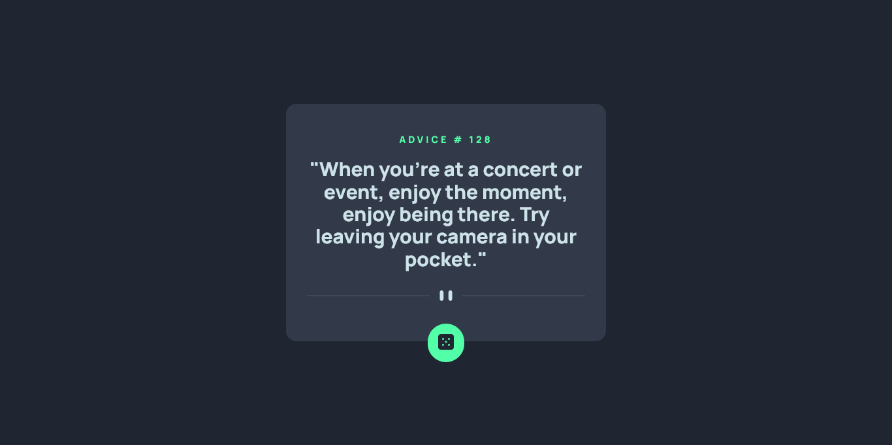

# Frontend Mentor - Advice generator app solution

This is a solution to the [Advice generator app challenge on Frontend Mentor](https://www.frontendmentor.io/challenges/advice-generator-app-QdUG-13db). Frontend Mentor challenges help you improve your coding skills by building realistic projects.

## Table of contents

- [Overview](#overview)
  - [The challenge](#the-challenge)
  - [Screenshot](#screenshot)
  - [Links](#links)
- [My process](#my-process)
  - [Built with](#built-with)
  - [What I learned](#what-i-learned)
  - [Continued development](#continued-development)
  - [Useful resources](#useful-resources)
- [Author](#author)
- [Acknowledgments](#acknowledgments)

## Overview

### The challenge

Users should be able to:

- View the optimal layout for the app depending on their device's screen size
- See hover states for all interactive elements on the page
- Generate a new piece of advice by clicking the dice icon

### Screenshot



### Links

- Solution URL: [Github](https://github.com/loifloro/advice-generator-app)
- Live Site URL: [Cloudfare](https://advice-generator-app-2el.pages.dev)

## My process

### Built with

- Semantic HTML5 markup
- CSS custom properties
- Flexbox
- CSS Grid
- Mobile-first workflow
- Sass
- Webpack
- [Advice Slip API](https://api.adviceslip.com)

### What I learned

This is the first project that I use Webpack, it is quite refreshing to use webpack because I actually got to use node_modules. Last week, I actually just learned that module bundlers are needed when using node_modules, after all this time I'm using the node_modules.

I actually used the import and export of ES6 modules. When using this modules I encountered this problem when using the onclick='generate_advice()' on the markup.

```js
import "normalize.css";
import "../main.scss";
import { generate_advice } from "./generate_advice";
```

```js
export function generate_advice();
```

### Continued development

After using Webpack, I'm gonna go explore to use PHP and Javascript frameworks.

### Useful resources

- [Fluid Typography Calculator](https://royalfig.github.io/fluid-typography-calculator/) - This is a helpful way to manage the clamp function for the font sizes.
- [Webpack Tutorial](https://www.youtube.com/watch?v=MpGLUVbqoYQ&list=PLu4GUyLT9o0UkDR-9Cq3HLdRt8mzhb9Sa) - This is the reference I used when I started creating my Github Gist for Webpack configs.
- [Webpack](https://webpack.js.org/)

## Author

- Github - [loifloro](https://github.com/loifloro/)
- Frontend Mentor - [@loifloro](https://www.frontendmentor.io/profile/loifloro)
- Twitter - [@loisfloro](https://www.twitter.com/loisfloro)

## Acknowledgments

Thank you Frontend Mentor for having projects that helps beginner to really enhance their knowledge.
